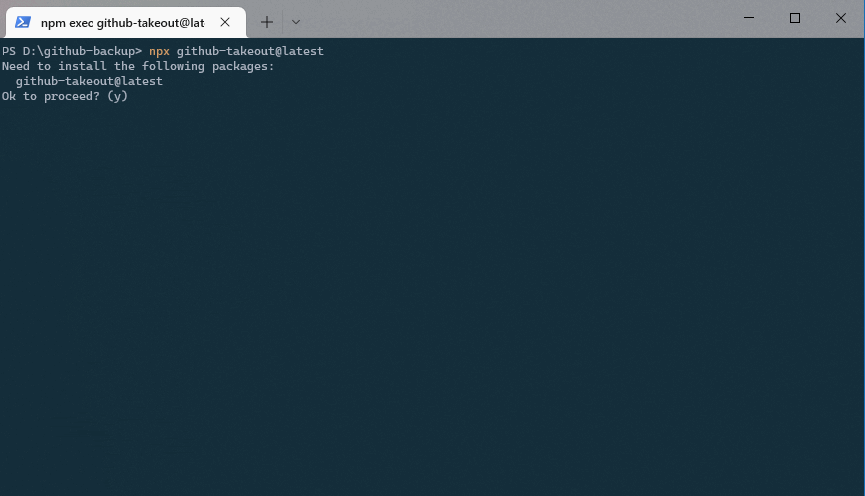

# github-takeout

> A utility for cloning all your repos, including issues, discussions, stargazers and more!

The tool gives you the ability to download a copy of your data on Github. You can highly customize what you want and what not, and also in which form. With all options enabled, the downloaded data includes

- clones of the repositories, optionally with all branches on remote
- all issues, including PRs, as HTML reports and raw JSON dumps, as well as .diff and .patch files for the PRs
- release information, including an HTML report of releases, and all release assets (optionally only from the latest release)
- HTML lists and JSON dumps of your starred/watched repos, stargazer lists of all your repos, lists of deploy keys, secrets and more

If enabled, the tool can also zip every repo individually afterwards. The process runs fairly quickly since most operations are performed parallelized to utilize resources.

## How to use

Install globally via

    npm install -g github-takeout

or directly use via

    npx github-takeout

You can also [download a prebuilt binary](https://github.com/lukasbach/github-takeout/releases) and run that.

Usage:

Just run `github-takeout` or `npx github-takeout` if you have not installed it.
The wizard will lead you through the process.

## How to develop

- `yarn` to install dependencies
- `yarn start` to run in dev mode
- `yarn test` to run tests
- `yarn lint` to test and fix linter errors

To publish a new version, the publish pipeline can be manually
invoked.
